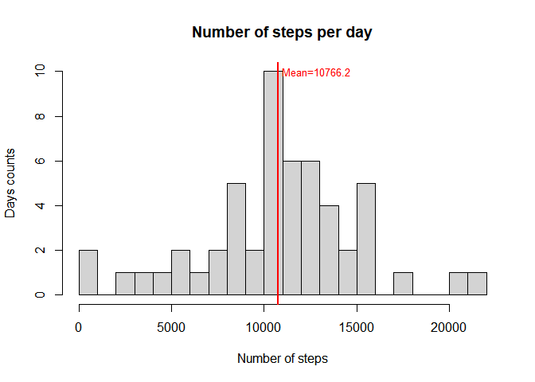
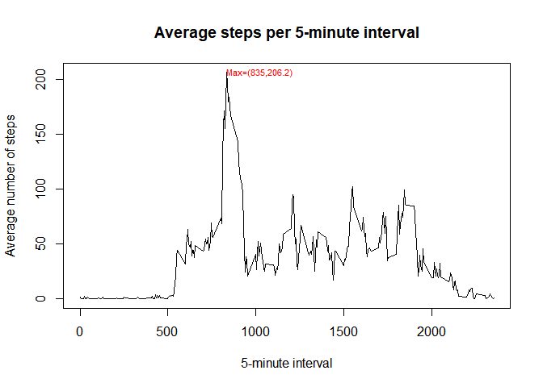
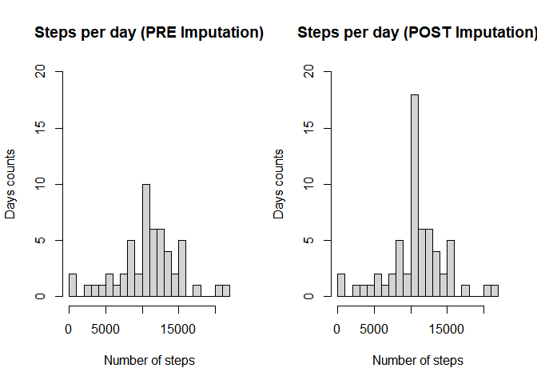
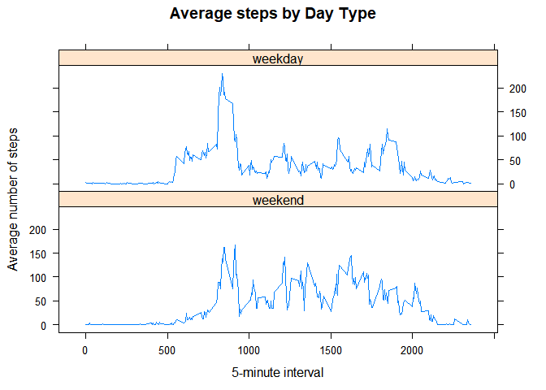

## Loading and preprocessing the data

Loading useful libraries

```r
library(readr)
library(dplyr)
library(lattice)
```

Setting and checking Work Directory

```r
path <- file.path("C:", "mio", "R", "Coursera",
                  "5-Reproducible Research",
                  "Assignment",
                  "ReproducibleResearch-Project1")
setwd(path)
getwd()
```

```
## [1] "C:/mio/R/Coursera/5-Reproducible Research/Assignment/ReproducibleResearch-Project1"
```

**1. Load the data**

```r
dataActivity <- read_csv(file = "activity.zip")
```

```
## Parsed with column specification:
## cols(
##   steps = col_double(),
##   date = col_date(format = ""),
##   interval = col_double()
## )
```


## What is mean total number of steps taken per day?

**1. Calculate the total number of steps taken per day**

```r
daySteps <- dataActivity %>% 
    group_by(date) %>% 
    summarise(stepsTot = sum(steps, na.rm = FALSE)) %>% 
    select(date, stepsTot)
```

**2. Make a histogram of the total number of steps taken each day**  
*(the vertical red line is Mean value of steps per day)*

```r
# calculation of mean to draw line in histogram
meanStep <- mean(daySteps$stepsTot, na.rm = TRUE)

hist(daySteps$stepsTot,
     main = "Number of steps per day",
     xlab = "Number of steps",
     ylab = "Days counts",
     breaks = 30)

abline(v = meanStep, lwd = 2, lty = "solid", col = "red")

text(x = meanStep + 200, y = 10, adj = 0,
     col = "red",
     cex = 0.8,
     labels = paste0("Mean=", round(meanStep, 1)))
```

<!-- -->

**3. Calculate and report the mean and median of the total number of steps taken per day**

```r
# mean previously calculated
# meanStep <- mean(daySteps$stepsTot, na.rm = TRUE)
medianStep <- median(daySteps$stepsTot, na.rm = TRUE)
```

**Mean** of the total number of steps taken per day=**10766.19**  
**Median** of the total number of steps taken per day=**10765**


## What is the average daily activity pattern?
**1. Make a time series plot of the 5-minute interval (x-axis) and the average number of
steps taken, averaged across all days (y-axis)**

```r
intervalSteps <- dataActivity %>% 
    group_by(interval) %>% 
    summarise(stepsMean = mean(steps, na.rm = TRUE)) %>% 
    select(interval, stepsMean)

# calculate max value of mean steps per interval
maxStep <- max(intervalSteps$stepsMean, na.rm = TRUE)
# calculate interval containing max number of steps
maxInterval <- intervalSteps$interval[which.max(intervalSteps$stepsMean)]

with(intervalSteps,
     plot(interval, stepsMean,
          type = "l",
          main = "Average steps per 5-minute interval",
          xlab = "5-minute interval",
          ylab = "Average number of steps"))

text(x = maxInterval, y = maxStep, adj = 0,
     col = "red",
     cex = 0.7,
     labels = paste0("Max=(", maxInterval, ",", round(maxStep, 1), ")"))
```

<!-- -->

**2. Which 5-minute interval, on average across all the days in the dataset, contains the
maximum number of steps?**

```r
# values previously calculated
# maxStep <- max(intervalSteps$stepsMean, na.rm = TRUE)
# maxInterval <- intervalSteps$interval[which.max(intervalSteps$stepsMean)]
```

The 5-minute interval containing the maximum number of steps
(=**206.17**) is **835**


## Imputing missing values
**1. Calculate and report the total number of missing values in the dataset**

```r
# number of NA in steps variable
nMissing <- sum(is.na(dataActivity$steps))
nMissing
```

```
## [1] 2304
```

**2. Devise a strategy for filling in all of the missing values in the dataset**  
The values of the average 5-minute interval (across all the days ignoring different
patterns in weekdays/weekends) were used to replace the NA values in variable steps

**3. Create a new dataset that is equal to the original dataset but with the missing data filled in**

```r
dataImputed <- dataActivity %>% 
    group_by(interval) %>% 
    mutate(stepsNoMiss = ifelse(is.na(steps), mean(steps, na.rm = TRUE), steps))

head(dataImputed)
```

```
## # A tibble: 6 x 4
## # Groups:   interval [6]
##   steps date       interval stepsNoMiss
##   <dbl> <date>        <dbl>       <dbl>
## 1    NA 2012-10-01        0      1.72  
## 2    NA 2012-10-01        5      0.340 
## 3    NA 2012-10-01       10      0.132 
## 4    NA 2012-10-01       15      0.151 
## 5    NA 2012-10-01       20      0.0755
## 6    NA 2012-10-01       25      2.09
```

```r
tail(dataImputed)
```

```
## # A tibble: 6 x 4
## # Groups:   interval [6]
##   steps date       interval stepsNoMiss
##   <dbl> <date>        <dbl>       <dbl>
## 1    NA 2012-11-30     2330       2.60 
## 2    NA 2012-11-30     2335       4.70 
## 3    NA 2012-11-30     2340       3.30 
## 4    NA 2012-11-30     2345       0.642
## 5    NA 2012-11-30     2350       0.226
## 6    NA 2012-11-30     2355       1.08
```

**4a. Make a histogram of the total number of steps taken each day**

```r
dayStepsImputed <- dataImputed %>% 
    group_by(date) %>% 
    summarise(stepsPre = sum(steps),
              stepsPost = sum(stepsNoMiss)) %>% 
    select(date, stepsPre, stepsPost)

par(mfrow = c(1, 2))

# Pre-Imputation
hist(dayStepsImputed$stepsPre,
     main = "Steps per day (PRE Imputation)",
     xlab = "Number of steps",
     ylab = "Days counts",
     ylim = c(0,20),
     breaks = 30)

# Post-Imputation
hist(dayStepsImputed$stepsPost,
     main = "Steps per day (POST Imputation)",
     xlab = "Number of steps",
     ylab = "Days counts",
     ylim = c(0,20),
     breaks = 30)
```

<!-- -->

**4b. Calculate and report the mean and median total number of steps taken per day**

```r
# calculate Mean and Median in Imputed Data
meanPost <- mean(dayStepsImputed$stepsPost, na.rm = TRUE)
medianPost <- median(dayStepsImputed$stepsPost, na.rm = TRUE)

meanPost
```

```
## [1] 10766.19
```

```r
medianPost
```

```
## [1] 10766.19
```

**4c. Do these values differ from the estimates from the first part of the assignment? What is the impact of imputing missing data on the estimates of the total daily number of steps?**

```r
# calculate Mean and Median in Raw Data
meanPre <- mean(dayStepsImputed$stepsPre, na.rm = TRUE)
medianPre <- median(dayStepsImputed$stepsPre, na.rm = TRUE)

comparison <- data.frame(var = c("Mean", "Median"),
                         pre = c(meanPre, medianPre),
                         post = c(meanPost, medianPost))
print(comparison)
```

```
##      var      pre     post
## 1   Mean 10766.19 10766.19
## 2 Median 10765.00 10766.19
```

The strategy of imputing missing data with the mean by 5-minute interval had no significant impact as underlined by the comparison of the above histograms and confirmed by the figures above: Mean values are identical and Median values are slightly different.
We can observe just an increase of the number of days having a total number of steps equal to Mean value because there were entire days with completely missing steps values as confirmed by table below (1440 mins/5-minutes interval = 288 intervals)


```r
countNA <- dataActivity %>%
    group_by(date) %>%
    summarise(nNAsteps = sum(is.na(steps))) %>% 
    filter(nNAsteps > 0)

print(countNA)
```

```
## # A tibble: 8 x 2
##   date       nNAsteps
##   <date>        <int>
## 1 2012-10-01      288
## 2 2012-10-08      288
## 3 2012-11-01      288
## 4 2012-11-04      288
## 5 2012-11-09      288
## 6 2012-11-10      288
## 7 2012-11-14      288
## 8 2012-11-30      288
```


## Are there differences in activity patterns between weekdays and weekends?

**1. Create a new factor variable in the dataset with two levels – “weekday” and “weekend” indicating whether a given date is a weekday or weekend day**

```r
Sys.setlocale("LC_ALL","English")
```

```
## [1] "LC_COLLATE=English_United States.1252;LC_CTYPE=English_United States.1252;LC_MONETARY=English_United States.1252;LC_NUMERIC=C;LC_TIME=English_United States.1252"
```

```r
dayType <- dataImputed %>% 
    mutate(date = as.Date(date),
           type = ifelse(weekdays(date) %in% c("Saturday", "Sunday"),
                         "weekend",
                         "weekday"),
           type = factor(type, levels = c("weekday", "weekend")))

str(dayType$type)
```

```
##  Factor w/ 2 levels "weekday","weekend": 1 1 1 1 1 1 1 1 1 1 ...
```

**2. Make a panel plot containing a time series plot of the 5-minute interval (x-axis) and the average number of steps taken, averaged across all weekday days or weekend days (y-axis)**

```r
stepsByDay <- dayType %>% 
    group_by(type, interval) %>% 
    summarise(stepsMean = mean(stepsNoMiss, na.rm = TRUE)) %>% 
    select(type, interval, stepsMean)

with(stepsByDay,
     xyplot(stepsMean ~ interval | type,
            index.cond = list(c(2, 1)), # to show weekday up and weekend bottom
            type = "l",
            main = "Average steps by Day Type",
            xlab = "5-minute interval",
            ylab = "Average number of steps",
            layout = c(1, 2)))
```

<!-- -->
